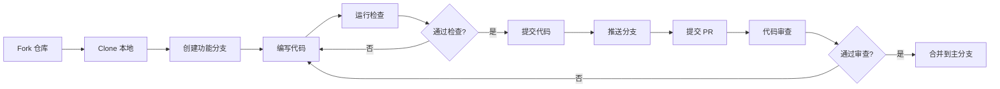

# 开发工作流

详细的开发工作流程。

## 开发流程图



## 分支策略

### 分支命名

- `main` - 主开发分支
- `doc` - 文档分支
- `feat/*` - 功能分支
- `fix/*` - 修复分支
- `refactor/*` - 重构分支

### 分支保护规则

-  需要 PR review
-  必须通过 CI 检查
-  代码检查必须通过

## 提交规范

### 提交信息格式

```
<type>(<scope>): <subject>

<body>

<footer>
```

### 示例

```
feat(attack): implement targeted SAMOO attack

Add support for targeted adversarial attacks with
configurable target class selection.

Closes #42
```

---

完整工作流文档待补充...
