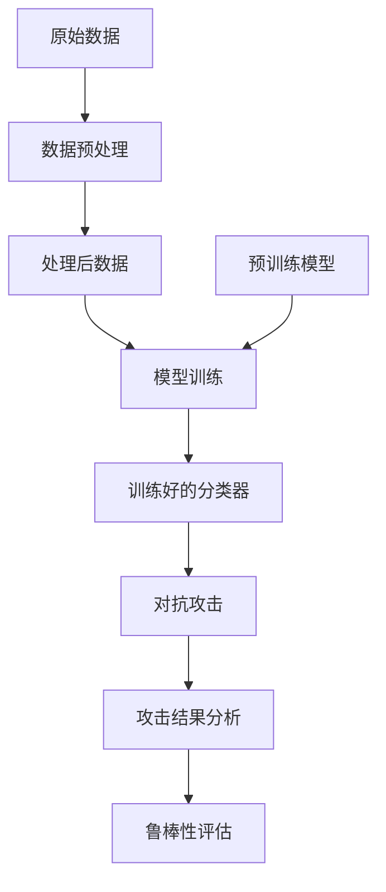

# 项目概览

## 📖 项目背景

银屑病（Psoriasis）是一种常见的慢性皮肤病，严重影响患者生活质量。随着深度学习技术的发展，**基于医学影像的自动诊断**已成为临床辅助诊断的重要手段。

然而，深度学习模型容易受到**对抗攻击**的影响，即使很小的扰动也可能导致模型做出错误的诊断。这对医疗应用的安全性和可信度构成了严重威胁。

## 🎯 研究目标

本项目致力于：

1. **深入研究**对抗攻击对银屑病诊断模型的影响机制
2. **设计防御策略**提升模型对对抗样本的鲁棒性
3. **开发工程化工具**支持医学影像的可靠诊断
4. **推进学术研究**并为开源社区做出贡献

## 🔬 技术方案

### 对抗攻击算法：SAMOO

**SAMOO**（Sparse Multi-Objective Optimization）是一种多目标优化框架，用于生成稀疏的对抗样本。

**核心优势**：

- ✅ **稀疏性**: 只修改极少数像素单元
- ✅ **多目标平衡**: 同时优化攻击效果和扰动强度
- ✅ **黑盒攻击**: 无需访问模型内部参数
- ✅ **实用性**: 更接近真实场景

### 骨干网络

#### ResNet50 (CNN)

- **优势**: 快速、高效、已验证
- **预训练**: ImageNet 预训练权重
- **应用**: 传统 CNN 方案的对标

#### SigLIP (Vision-Language)

- **优势**: 0-shot 和 few-shot 学习能力
- **多模态**: 结合视觉和语言信息
- **灵活性**: 支持自定义标签描述

## 📊 数据集支持

| 数据集 | 类别数 | 用途 | 状态 |
|--------|--------|------|------|
| **CIFAR-10** | 10 | 基准对比 | ✅ 支持 |
| **ImageNette** | 10 | 通用测试 | ✅ 支持 |
| **银屑病数据** | 2 | 临床应用 | ✅ 支持 |

## 🏗️ 系统架构



## ⚙️ 工作流程

### 第一步：环境准备

```bash
# 克隆仓库
git clone https://github.com/NAC-HUST/Psoriasis-Robust-Adv-Defense.git
cd Psoriasis-Robust-Adv-Defense

# 安装依赖
uv sync
```

### 第二步：数据预处理

```bash
uv run main.py preprocess \
    --dataset-root dataset \
    --datadir psoriasis_normal \
    --image-size 224
```

**输出**:
- 预处理后的图像: `dataset/processed_data/psoriasis_normal/<class>/`
- 类别清单: `dataset/processed_data/psoriasis_normal/class_manifest.csv`

### 第三步：下载预训练模型

```bash
uv run main.py download-models
```

**输出**:
- ResNet50: `model/pretrained_model/resnet/resnet50_imagenet1k_v2.pth`
- SigLIP: `model/pretrained_model/siglip/`

### 第四步：训练分类器

```bash
# 训练 ResNet50
uv run main.py train \
    --backbone resnet50 \
    --datadir psoriasis_normal \
    --epochs 3 \
    --batch-size 16

# 训练 SigLIP
uv run main.py train \
    --backbone siglip \
    --datadir psoriasis_normal \
    --epochs 3 \
    --freeze-siglip-backbone
```

**输出**: `model/trained_classifier/<backbone>/best_classifier.pt`

### 第五步：对抗攻击

```bash
uv run main.py attack \
    --backbone resnet50 \
    --checkpoint model/trained_classifier/resnet50/best_classifier.pt \
    --datadir psoriasis_normal \
    --sample-index 0
```

**输出**: `output/attack/resnet50/`

## 🎓 学术价值

### 研究意义

1. **医疗安全**: 评估深度学习在医疗诊断中的风险
2. **防御设计**: 提出提升医学模型鲁棒性的新方法
3. **开源贡献**: 为学术界和工业界提供参考实现
4. **实践指导**: 指导医学 AI 系统的安全部署

### 创新点

- 🎯 首次系统研究银屑病诊断模型的对抗鲁棒性
- 🎯 融合多目标优化与医学应用的创新方案
- 🎯 支持多模态学习的统一对抗框架
- 🎯 完整的工程化实现和开源代码

## 🤝 参与方式

我们欢迎：

- 💡 **提意见**: 通过 Issue 分享想法
- 🔧 **贡献代码**: 提交 Pull Request
- 📝 **完善文档**: 改进项目说明
- 🧪 **测试验证**: 报告 Bug 和不足
- 📣 **宣传推广**: 在学术和社区中推广

详见 [贡献指南](../contributing/guide.md)

## 📚 相关资源

- 📖 [PyTorch 官方文档](https://pytorch.org/)
- 📖 [Transformers 库文档](https://huggingface.co/docs/transformers/)
- 📖 [医学影像 AI 综述](https://example.com)
- 📖 [对抗攻击研究进展](https://example.com)

---

**下一步**: 😊 [安装指南](installation.md) | [快速开始](quickstart.md)
